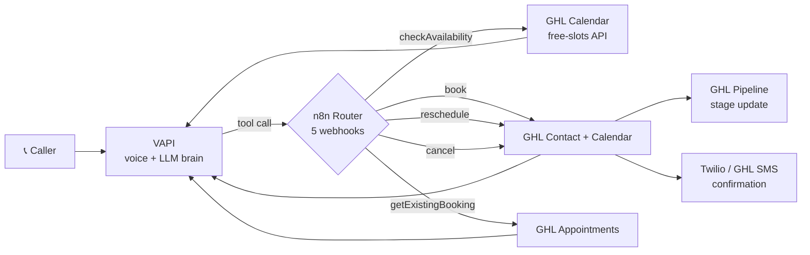
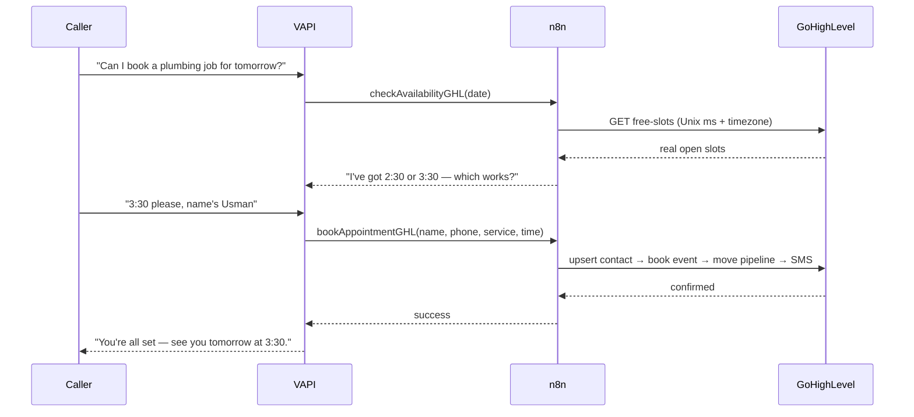

<div align="center">

# 📞 AI Voice Receptionist for GoHighLevel

### A 24/7 voice agent that answers the phone, reads a live calendar, and books, reschedules, and cancels appointments by voice — then updates the CRM. No human on the line.


</div>

---

## The one-line pitch

> A missed call after hours isn't a missed call. It's a customer who just booked with the competitor instead.

This project closes that gap. It's a production voice agent that picks up every call, checks **real** availability on a GoHighLevel calendar, and completes the full booking lifecycle — create contact, book, reschedule, cancel, move the pipeline, send an SMS confirmation — entirely by voice, around the clock.

It is **not** a demo that reads from a script. It talks to the live GHL API on every call and refuses to speak a time it hasn't actually verified.

---

## 🎥 See it work

| | Link |
|---|---|
| 🗣️ Full voice walkthrough | `https://www.loom.com/share/5eee8303bfe64e659869980768394bae` |
| 🌐 Live web-call demo | `https://michigan-home-sync.base44.app` |

> Swap these for your own links. The web demo lets anyone talk to the agent from the browser.

---

## ✨ What it does

- **Answers 24/7** — every call picked up on the first ring, nights and weekends included.
- **Never invents availability** — it queries the GHL calendar for real open slots *before* it offers a single time.
- **Full booking lifecycle by voice** — book, reschedule, and cancel, all handled in natural conversation.
- **Finds returning callers** — searches an existing booking by full name → first name → phone, so people don't have to spell everything out.
- **Writes straight to the CRM** — creates/updates the GHL contact, books the calendar event, advances the pipeline stage, and fires an SMS confirmation.
- **Knows the business** — hours, services, pricing, and an emergency-detection path that escalates urgent calls instead of quoting a price.
- **Timezone-correct** — availability shown and appointments written in the business's local time, not raw UTC.

---

## 🏗️ Architecture



**Booking, end to end:**



---

## 📸 Screenshots

**The n8n orchestration — 37 nodes, 5 tool branches, error handling:**


| Booking written live to the GHL calendar | Talking to the agent in the browser |
|:---:|:---:|
|  |  |

---

## 🧰 Tech stack

| Layer | Tool | Role |
|---|---|---|
| Voice + brain | **VAPI** | Speech-to-text, LLM reasoning, tool calling, text-to-speech |
| Voice model | **ElevenLabs** | Natural, low-latency TTS |
| Orchestration | **n8n** | Receives tool calls, talks to every API, formats responses |
| CRM / Calendar / Pipeline | **GoHighLevel** | Contacts, real-time calendar, opportunity pipeline, SMS |
| Telephony | **Twilio** | Phone number the agent answers on |

---

## 🔧 How the voice tools work

The agent exposes **five** tools to VAPI. Each is a dedicated webhook branch in n8n.

| Tool | Fires when | What happens |
|---|---|---|
| `checkAvailabilityGHL` | caller asks about a day/time | Queries GHL free-slots, returns **only real** open times |
| `bookAppointmentGHL` | caller confirms a slot | Upserts contact → books event → moves pipeline → SMS confirmation |
| `getExistingBookingGHL` | caller wants to change/cancel | Finds the appointment: full name → first name → phone |
| `rescheduleAppointmentGHL` | caller confirms a new time | Re-checks availability, moves the booking |
| `cancelAppointmentGHL` | caller confirms cancellation | Cancels the booking and updates the pipeline |

The system prompt that drives the agent's behaviour lives in [`/prompts`](./prompts) so you can see exactly how it's told to think — including the hard rule: **never speak a time before the availability tool returns.**

---

## 🧠 Engineering notes — the parts that actually bite

Most of the work in a project like this isn't the happy path. These are the real problems solved along the way — documented here because if you're building on GHL, they'll save you days.

- **Use n8n *Header Auth*, not the generic *Bearer Auth* node.** Bearer Auth has a long-standing bug where it silently fails to attach the `Authorization` header. Header Auth with name `Authorization` and value `Bearer <PIT>` works every time.
- **Every GHL v2 call needs `Version: 2021-07-28`** and the `services.leadconnectorhq.com` base URL — not the old `rest.gohighlevel.com/v1`.
- **Timezone is the silent killer.** GHL's free-slots endpoint returns times *with* the account's offset (e.g. `+05:00`). If your booking write sends a naive datetime with no offset, GHL reads it as UTC and rejects it as *"slot no longer available"* — even though availability just offered it. Always write the appointment with the **matching offset**.
- **free-slots wants Unix millisecond timestamps** and a URL-encoded `timezone` (e.g. `Asia%2FKarachi`).
- **Appointments live at `/contacts/{id}/appointments`** and come back in an `events` array — not `appointments`.
- **Opportunities: GET then PUT, never blind POST.** POST-ing an opportunity for a contact that already has one returns `400 — duplicate opportunity`. Look it up first, update if it exists.
- **Make CRM + SMS side-effects non-blocking.** The caller's spoken confirmation should never depend on a pipeline update or an SMS succeeding. Set those nodes to continue-on-error so a CRM hiccup can't strangle the "you're all set."
- **VAPI response shape is exact:** `{ "results": [{ "toolCallId": "<id>", "result": "<single-line string>" }] }`, HTTP `200`.
- **Publish, don't draft.** Production calls run the *published* version of the workflow, not whatever's open in your editor.
- **Model choice changes tool discipline.** Weaker models will happily *say* available times before calling the availability tool. Pick a model that respects tool order, and enforce it in the prompt.

---

## 🔑 Two ways to connect GoHighLevel

GoHighLevel gives you two ways to authenticate an integration. This project uses **Method B (Private Integration Token)** — here's both, and the reasoning.

### Method A — Marketplace OAuth App (the official / standard route)
The standard way GoHighLevel expects public, multi-account apps to integrate. You create a developer account in the GoHighLevel Marketplace, register an app, and use the OAuth 2.0 flow (client ID/secret → access + refresh tokens) to call the API on a location's behalf.
- ✅ The proper choice if you're distributing one app across many client accounts.
- ⚠️ Creating the marketplace developer account requires **phone / SMS OTP verification** — if that number can't receive the OTP (a common blocker outside the US), you can't complete signup.
- ⚠️ n8n's built-in HighLevel (OAuth) node also has documented refresh-token bugs that can silently break a workflow after the token cycles.

### Method B — Private Integration Token (PIT) — used here
A static, scoped token created directly under `Settings → Private Integrations` in a normal agency or sub-account.
- ✅ **No marketplace developer account. No SMS OTP.** Generated in a few clicks by an admin.
- ✅ Works cleanly as a Bearer token inside an n8n **Header Auth** credential.
- ✅ Ideal for single-account, client-specific builds — and for anyone in a region where marketplace SMS verification fails.

> **Bottom line:** unless you're publishing a public multi-account app, the PIT is the simpler, more portable choice — and it removes the SMS-OTP roadblock entirely.

---

## 🚀 Getting started

### Prerequisites
- A GoHighLevel account (agency or sub-account)
- A VAPI account + a phone number (via Twilio)
- An n8n instance (cloud or self-hosted)
- An ElevenLabs voice

### 1. Create your GoHighLevel credential
Use a **Private Integration Token** (see [Two ways to connect](#-two-ways-to-connect-gohighlevel) above): `Settings → Private Integrations → Create`, with calendar, contacts, opportunities, and `conversations/messages.write` scopes.

### 2. Configure environment values
Never hardcode these into a committed file. Use placeholders like:

```env
GHL_LOCATION_ID=your_location_id
GHL_CALENDAR_ID=your_calendar_id
GHL_PIPELINE_ID=your_pipeline_id
GHL_STAGE_BOOKED=your_booked_stage_id
GHL_STAGE_CANCELLED=your_cancelled_stage_id
GHL_PIT_TOKEN=pit-xxxxxxxx-xxxx-xxxx   # store ONLY in the n8n Header Auth credential
```

### 3. Import the workflow
Import [`/workflow/ghl-voice-receptionist.n8n.json`](./workflow) into n8n. Then:
- Create a **Header Auth** credential: name `Authorization`, value `Bearer <your PIT>`.
- Set your `Version: 2021-07-28` header on the GHL request nodes.
- Replace the placeholder IDs with your own.
- **Publish** the workflow and copy the 5 webhook URLs.

### 4. Wire up VAPI
- Create an assistant, paste the system prompt from [`/prompts`](./prompts).
- Add the 5 tools, each pointing at its n8n webhook URL.
- Attach your ElevenLabs voice and a phone number.

### 5. Call it
Ring the number and book something. Watch the contact, calendar event, and pipeline update in GHL in real time.

---

## 📁 Repo structure

```
.
├── README.md
├── LICENSE
├── workflow/
│   └── ghl-voice-receptionist.n8n.json   # secrets scrubbed → placeholders only
├── prompts/
│   └── system-prompt.md                  # the agent's brain
└── assets/
    └── screenshots/                       # workflow + call screenshots
```

---

## 🗺️ Roadmap

This is the first in a series of GoHighLevel automation builds:

- [x] **Inbound voice receptionist** (this repo) — book / reschedule / cancel by voice
- [ ] **Missed-call text-back** — hang-up → instant SMS → book by text
- [ ] **Outbound voice agent** — new lead → AI calls within 60s → qualifies → books
- [ ] **Website form → appointment pipeline**
- [ ] **RAG knowledge-base chatbot** — trained on client docs, escalates to a human

---

## 🔒 Security

- The committed workflow contains **placeholder IDs only**. Real IDs and tokens live in your n8n credential store and your own environment.
- Add a `.gitignore` for any local `.env` or exported workflow that still holds live values.
- Rotate your PIT if it's ever been committed anywhere public.

---

## 👤 Author

**Usman Farooq** — Smart AI Solutions
AI automation developer building voice agents & CRM automations for GoHighLevel businesses.

- 🔗 LinkedIn: `https://linkedin.com/in/usman-rai`
- 💻 GitHub: `https://github.com/Usman-rai`
- ✉️ Email: `smart.aisolutions.services@gmail.com`

> Building appointment automation for clinics, home-services, and any business that lives and dies by its calendar. Open to white-label work with GHL agencies.

---

## 📄 License

MIT — see [LICENSE](./LICENSE). Use it, learn from it, build on it.
